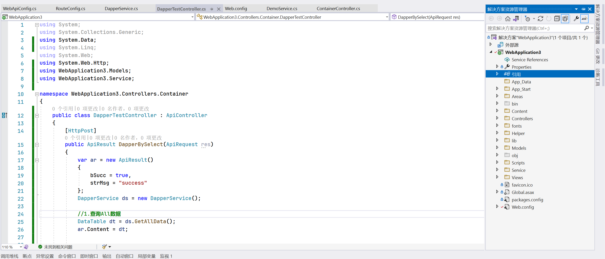
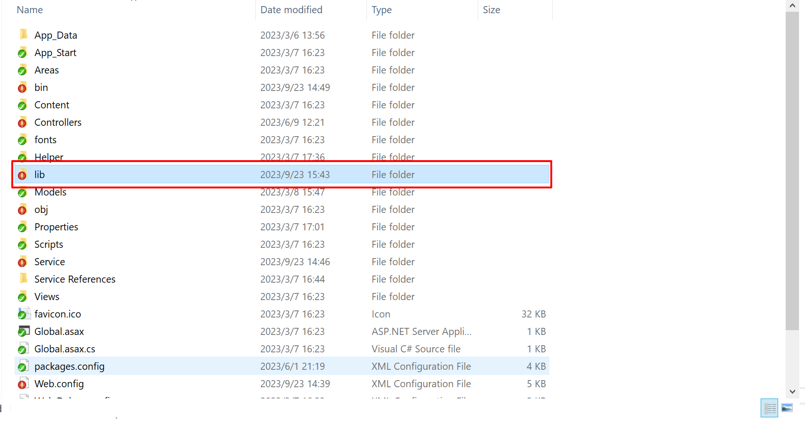
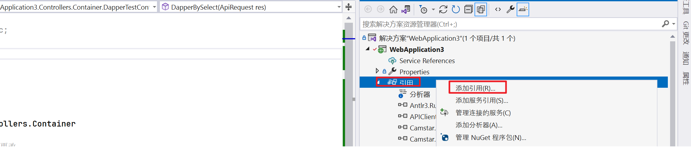
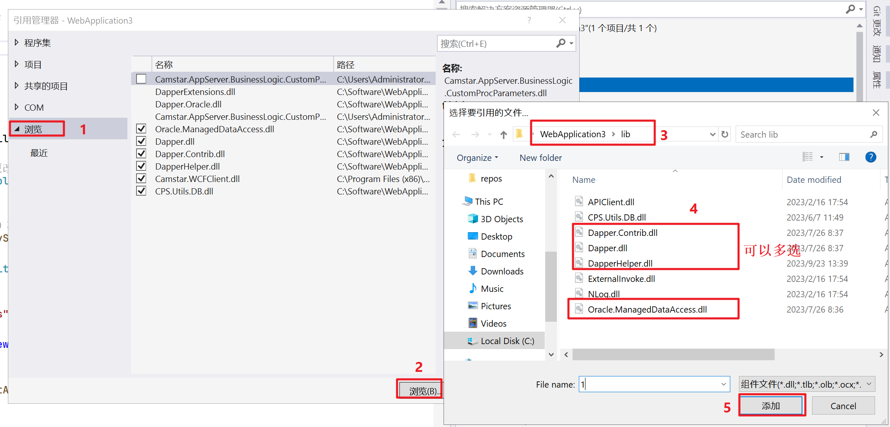
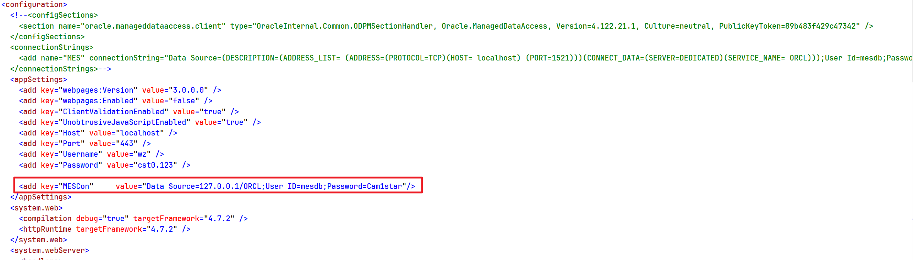
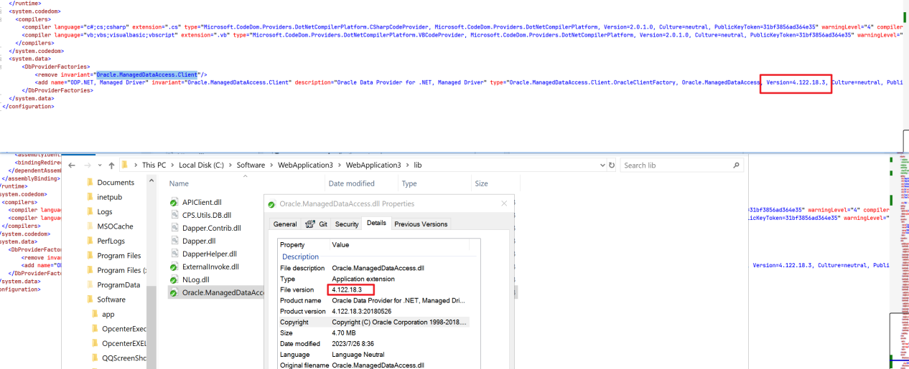
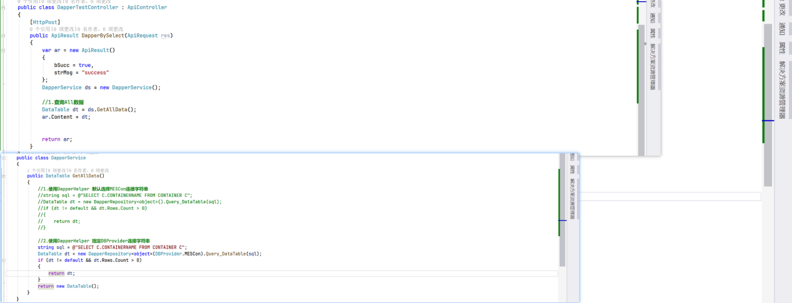

# 第1章 工具类介绍

## 1.1 说明 

​		**DapperHelper**工具类是一个强大的数据库操作工具，专为C#应用程序开发者设计，用于简化与Oracle数据库的交互过程。通过结合Dapper库的高性能数据访问功能，**DapperHelper**提供了一种简单而有效的方式来执行查询、插入、更新、删除、批量SQL执行、事务管理和存储过程调用执行等操作，帮助开发人员快速、高效地处理数据库操作。

该工具类的主要优势包括轻量级、易于使用以及优化的性能，使得开发者能够专注于应用程序的核心功能，而无需深入处理繁琐的数据库交互细节。无论是构建新的数据库应用程序还是维护现有的项目，**DapperHelper**都能为您提供强大的支持。

​		**DapperHelper**工具类是一个强大的数据库操作工具，专为C#应用程序开发者设计，用于简化与Oracle数据库的交互过程。通过结合Dapper库的高性能数据访问功能，**DapperHelper**提供了一种简单而有效的方式来执行查询、插入、更新删除操作，帮助开发人员快速、高效地处理数据库操作。

​		本文档将详细介绍**DapperHelper**工具类的功能、用法以及最佳实践，以帮助您快速上手并充分利用这一工具来简化数据库操作，提高开发效率。从连接数据库到执行复杂的查询，**DapperHelper**将成为您在Oracle数据库操作中的可靠伙伴。

## 1.2 依赖Dapper

​		**DapperHelper**工具类紧密依赖于Dapper库，Dapper是一个高性能的对象关系映射（ORM）库，旨在简化数据库操作和数据交互。Dapper以其卓越的性能而闻名，它的轻量级特性使其成为C#开发者的首选工具之一。

​		Dapper的主要特点包括快速的查询执行、优化的性能、对多种数据库的支持、简单的API、映射功能以及灵活的参数化查询。这使得Dapper不仅能够提供高效的数据库访问，还能够映射数据库结果到强类型的对象，使开发更加便捷和可维护。

​		通过与Dapper库的协同工作，**DapperHelper**工具类将这些优势引入了Oracle数据库操作中，为开发者提供了一种高效、可靠的方式来处理Oracle数据库。这种依赖关系确保了**DapperHelper**在性能和可用性方面表现出色，成为数据库操作的理想解决方案。

>  所以在使用**DapperHelper**时需要安装或添加Dapper依赖。目前**DapperHelper**需要添加【`Dapper.Contrib.dll`】与【`Dapper.dll`】两个依赖。

## 1.3 依赖Oracle.ManagedDataAccess 

​		**DapperHelper**工具类在操作Oracle数据库时依赖于`Oracle.ManagedDataAccess`库，这是Oracle官方提供的.NET数据库连接库。`Oracle.ManagedDataAccess`库为C#开发者提供了可靠的、高性能的Oracle数据库连接和操作能力。

主要优点包括与Oracle数据库的完美集成、性能优化、高度可靠性以及广泛的功能支持。此库具备了连接池管理、数据缓存、参数化查询等关键功能，以确保在与Oracle数据库交互时保持高效、安全和可维护的标准。

​		**DapperHelper**充分利用了**Oracle.ManagedDataAccess**库的强大功能，使其能够在Oracle数据库操作中提供无缝的数据连接和交互，同时保持了数据的完整性和性能。这种依赖关系确保了**DapperHelper**在处理Oracle数据库时能够胜任各种任务，从查询到数据修改，都能够以高效且可靠的方式进行处理。因此，**DapperHelper**是在Oracle环境下进行数据库操作的理想选择。

> 所以在使用DapperHelper时需要安装或添加**Oracle.ManagedDataAccess**依赖。目前**DapperHelper**需要添加【`Oracle.ManagedDataAccess.dll`】依赖，具体使用需要主要Dll版本。


# 第2章 添加DapperHelper依赖 

## 2.1 创建项目 

​		测试DapperHelper类库，可以新建一个【.Net WebApi】项目，通过在项目中引入DapperHelper类库即可使用该类库提供的方法，图2.1.1



<p style="text-align:center">图 2.1.1 新建WebApi项目</p>

## 2.2 添加Dapper相关依赖

​		①打开项目根目录添加新目录Lib，该目录用于类库Dll存放，图2.1.2；



<p style="text-align:center">图 2.1.2 新建Lib目录</p>

​		②复制DapperHelper类库dll及其依赖dll到新建的Lib目录中，图2.1.3；


<p style="text-align:center">图 2.1.3 复制DapperHelper类库到指定目录</p>

​		③在WebApi项目中添加复制到Lib目录下的DapperHelper及其依赖dll到项目中。操作步骤为，展开项目【引用】；并鼠标点击【引用】；点击成功后鼠标右键即可弹出菜单，图2.1.4；



<p style="text-align:center">图 2.1.4 项目添加引用</p>

​		④填出添加依赖框后，选择【浏览】模块，选择后点击右下侧的【选择】按钮即可打开文件选择器；在打开文件选择器并打开项目中新建的Lib文件夹；打开文件夹后通过Ctrl多选DapperHelper类库dll及其依赖dll，图2.1.5；



<p style="text-align:center">图 2.1.5 添加引入Lib中的dll依赖</p>

## 2.3 修改配置 

​	DapperHelper是针对Orcale数据库进行访问操作，修改WebApi配置文件主要是添加数据库连接字符串，图2.1.6。



<p style="text-align:center">图 2.1.6 配置文件中添加数据库连接字符串</p>

​		添加连接地址字符串后，还需要注意【[Oracle.ManagedDataAccess.dll]】依赖版本与Web.config中指定的【Oracle.ManagedDataAccess.Client】配置中的版本一致，图2.1.7。



<p style="text-align:center">图 2.1.7 确认dll版本与配置版本</p>

## 2.4 编辑写DapperHelper简单代码 

​	在WebApi项目中新建Controller，新建完成后添加一个Action接口。新建接口后创建DapperService，并通过接口Action调用Service中的测试方法，图2.2.1。



<p style="text-align:center">图 2.2.1 新建类库测试类</p>

​	DapperService中添加测试案例，①创建SQL字符串，②使用DapperHelper调用执行SQL，详细示例代码如下。

```c#
string sql = @"SELECT C.CONTAINERNAME FROM CONTAINER C"; 
                                                            
DataTable dt = new  DapperRepository(DBProvider.MESCon).Query_DataTable(sql);   
```


## 2.5 测试DapperHelper 

​	启动WebApi接口程序，启动成功后通过接口测试工具调用新建测Action接口测试是否执行成功，并相应对于查询数据，图2.2.1。


<p style="text-align:center">图 2.2.1 启动WebApi程序并测试</p>


#  第3章 创建DapperHelper实例 

## 3.1 默认创建实例方式 

​		默认创建DapperHelper操作对象，直接在代码中添加以下代码即可完成创建。

```c#
DapperRepository dapperRepository = new DapperRepository<object>();
```

​		使用默认创建dapperRepository操作对象需要在Web.config（App.Config）配置文件中的AppSettings标签下添加默认的数据库连接字符串

```xml
<add key="MESCon"  value="Data Source=127.0.0.1/ORCL;User ID=mesdb;Password=Cam1star"/>
```

## 3.2 可选连接地址配置方式

​		可选不同的数据库连接地址进行创建多个数据库操作对象，该方式可以方便用户在代码中创建多个数据库操作对象，红色部分为Web.config（App.Config）中数据库连接字符串配置的Key。

```c#
DapperRepository dapperRepository = 
new DapperRepository<object>(DBProvider.MESCon);
```

​		想切换配置地址可以直接切换【DBProvider】类型即可，切换完成后需要在配置文件中添加相应Key的连接地址，下面两者是必须配套使用。

```c#
DapperRepository dapperRepository = 
new DapperRepository<object>(DBProvider.InterfaceDB)
```

```xml
<add key="InterfaceDB"   value="Data Source=127.0.0.1/ORCL;User ID=mesdb;Password=Cam1star"/>
```

​		DBProvider默认提供4个连接类型

```text
MESCon, InterfaceDB, MESLogCon, MESOtherCon
```

​		DapperHelper新增直接通过连接地址字符串构建连接对象

```C#
string connectString = @"Data Source=127.0.0.1/ORCL;User ID=mesdb;Password=Cam1star";
DapperRepository dapperRepository = 
new DapperRepository<object>(connectString)
```


# 第4章 DapperHelper主要方法

## 4.1 Query_DataTable {#query_datatable .unnumbered}

​	查询数据并以DataTable对象返回

```c#
DataTable dt = new DapperRepository<object>().Query_DataTable(sql);
```

## 4.2 Query {#query .unnumbered}

①查询数据返回具体实体对象

```c#
Container dt = new DapperRepository<object>().Query<Container>(sql).FirstOrDefault();
```

②查询数据返回具体实体对象集合（List）

```c#
List<Container> dts = new DapperRepository<object>().Query<Container>(sql).ToList();
```

③查询数据返回对象数组（Array）

```c#
Container[] dts = new DapperRepository<object>().Query<Container>(sql).ToArray();
```

## 4.3 Execute 

​		对数据库的Create、Update、Delete操作的SQL语句可以使用Execute方法执行。

```c#
int executResult = new DapperRepository<object>().Execute(sql, null);
```

## 4.4 BatchExecutionForeach 

​		对数据库的Create、Update、Delete操作的多条SQL语句可以使用**BatchExecutionForeach**方法执行。多条SQL需用List来赋值并作为参数传递给【`BatchExecutionForeach`】方法。

​		SQL集合批量（循环）执行，执行完成后返回 \[Row\]
表示执行成功返回受影响行数；\[-1\]表示执行异常（回退异常）；\[-2\]表示执行SQL集合，执行结束后，成功数不等于集合数（回退事务）。

```c#
string sql = @"Update CONTAINER C SET C.status = '1' WHERE C.CONTAINERNAME = '20230601001';";
string sql2 = @"Update CONTAINER C SET C.status = '1' WHERE C.CONTAINERNAME = '20230601002';";
string sql3 = @"Update CONTAINER C SET C.status = '1' WHERE C.CONTAINERNAME = '20230601003';";
List<string> SQLList = new List<string>() { sql , sql2, sql3};
int executResult = new DapperRepository<object>().BatchExecutionForeach(SQLList);
```

## 4.5 BatchExecutionBeginEnd 

​		对数据库的Create、Update、Delete操作的多条SQL语句可以使用**BatchExecutionBeginEnd**方法执行。多条SQL需用List来赋值并作为参数传递给【`BatchExecutionBeginEnd`】方法。

​		SQL集合拼接为字符串采用BeginEnd执行，SQL集合中的SQL必须以\[;\]结尾，执行完成后返回
\[1\] 表示执行成功（提交事务）；\[0\]表示执行异常（回退异常），出现异常可能为SQL集合中部分SQL语句错误，或者SQL结尾未加\[;\]。

```c#
string sql = @"Update CONTAINER C SET C.status = '1' WHERE C.CONTAINERNAME = '20230601001';";
string sql2 = @"Update CONTAINER C SET C.status = '1' WHERE C.CONTAINERNAME = '20230601002';";
string sql3 = @"Update CONTAINER C SET C.status = '1' WHERE C.CONTAINERNAME = '20230601003';";
List<string> SQLList = new List<string>() { sql, sql2, sql3 };
int executResult = new DapperRepository<object>().BatchExecutionBeginEnd(SQLList);
```

## 4.6 ExecuteProcedure {#executeprocedure .unnumbered}

​		**DapperHelper**调用存储过程并执行，可以调用【**ExecuteProcedure**】方法。

​		该方法需要传参【事务名称】，【事务输入与输出集合对象】。以下调用的存储过程是将存入参数\*2并返回。

```c#
string ProcedureName = "TEST01"; //存储过程名称
DynamicParameters dynamicParameters = new DynamicParameters();//封装存储过程需要的参数
dynamicParameters.Add("inputValue", 120, DbType.Int32);
dynamicParameters.Add("outputVale", dbType:DbType.Int32, direction:ParameterDirection.Output);
new DapperRepository<object>().ExecuteProcedure(ProcedureName, dynamicParameters);
//获取 存储过程执行结果
int executResult = dynamicParameters.Get<int>("outputVale");
return executResult;
```


## 4.7 Other 

​		**DapperHelper**类库中还有许多的操作数据库方法，如果有Task需求，可以调用对应方法。

更多使用方法需要在使用中去探索\...\...


# 第5章 SQL传参(去硬解析) 

## 5.1 硬解析介绍

​		SQL传参的方式以及参数格式在Oracle数据库中可以对性能产生重要影响。避免硬解析（Hard Parsing）是优化SQL性能的关键之一。以下是一些关于SQL传参和参数格式的指南：

1.  **避免硬解析：**

​		硬解析是指Oracle数据库在执行SQL语句之前需要对其进行语法分析和查询优化的过程。这个过程消耗大量的CPU和内存资源，并且降低了性能。要避免硬解析，可以考虑以下几点：

​		①使用绑定变量：使用绑定变量而不是直接将参数嵌入SQL语句中。绑定变量可以让Oracle重复使用相同的执行计划，而不需要每次都重新解析SQL语句。

​		②使用预编译语句：如果你的应用程序支持预编译语句，可以考虑使用这种方式，它会在数据库中缓存执行计划。

​		③维护稳定的SQL：避免频繁更改SQL语句的结构，这会导致更多的硬解析。尽量保持SQL语句的稳定性。

2.  **SQL传参数格式：**

​		SQL参数的格式通常取决于编程语言和数据库连接库的要求，但通常有以下几种常见的方式：

​		①绑定变量：使用绑定变量（如:param或?）来代替实际的参数值。这些变量会在执行时被具体的参数值替代，从而降低硬解析的频率。

​		②命名参数：在SQL中使用命名参数，例如:username，然后在代码中将参数值与参数名关联。

​		③位置参数：使用位置参数，例如?，并按照它们在SQL语句中的顺序传递参数值。

​		④命名参数绑定：在一些数据库连接库中，可以使用命名参数绑定，将参数名与值一起传递，以便更清晰地指定参数。

​		具体的SQL参数格式取决于你使用的编程语言和数据库连接库。请查阅相关文档以了解如何正确传递参数。综上所述，正确的参数传递方式和避免硬解析是优化SQL性能的关键策略之一，可以提高数据库操作的效率。

## 5.2 普通传参传参格式 

​		普通参数格式主要是在SQL中条件等指定参数。使用参数格式化需要注意，参数赋值请指定对于的参数（ContainerName = LOT）。ContainerName为参数名称，LOT为具体参数。

```c#
string sql = @"SELECT C.CONTAINERNAME, C.STATUS FROM CONTAINER C WHERE C.CONTAINERNAME = :ContainerName";
DataTable dt = new DapperRepository<object>().Query_DataTable(sql, new { ContainerName = "20230601001" });
```

```c#
string sql = @"SELECT C.CONTAINERNAME, C.STATUS FROM CONTAINER C WHERE C.CONTAINERNAME = :ContainerName";
string LOT = "20230601001";
DataTable dt = new DapperRepository<object>().Query_DataTable(sql, new { ContainerName = LOT  });
```


## 5.3 IN参数格式

​		IN参数格式的参数，参数需要一个List集合或者Array数组。

```c#
string sql = @"SELECT C.CONTAINERNAME, C.STATUS FROM CONTAINER C WHERE C.CONTAINERNAME IN :ContainerNames";
List<string> lots = new List<string>() { "20230601001", "20230601002" };
DataTable dt = new DapperRepository<object>().Query_DataTable(sql, new { ContainerNames = lots });
```

```c#
string sql = @"SELECT C.CONTAINERNAME, C.STATUS FROM CONTAINER C WHERE C.CONTAINERNAME IN :ContainerNames";
string[] lots = new string[] { "20230601001", "20230601002" };
DataTable dt = new DapperRepository<object>().Query_DataTable(sql, new { ContainerNames = lots });
```


## 5.4 like 参数格式 

​		使用LIKE关键字来传参需要提前将%号与数据组合到一起，组合完成后在通过匿名对象传给指定参数。

```c#
string sql = @"SELECT C.CONTAINERNAME, C.STATUS FROM CONTAINER C WHERE C.CONTAINERNAME LIKE :ContainerName";
string lot = "2023060100%";
DataTable dt = new DapperRepository<object>().Query_DataTable(sql, new { ContainerName = lot });
```

```c#
string sql = @"SELECT C.CONTAINERNAME, C.STATUS FROM CONTAINER C WHERE C.CONTAINERNAME LIKE :ContainerName";
string lot = "%060100%";
DataTable dt = new DapperRepository<object>().Query_DataTable(sql, new { ContainerName = lot });
```


## 5.5 Other {#other-1 .unnumbered}

​		其他SQL传参数方法需要在使用中探索\...\...


# 第6章 类库包及源码 


## 6.1 类库包 

类库包这里指的是**DapperHelper**类库编译后的dll，在使用dll需要添加其对应的dll。如果项目中已经包含了相同的依赖dll，可以共用其存在的dll。不过需要注意版本冲突等问题。


## 6.2 类库包下载地址

工具类【Giee】下载地址 [DapperHelper_package_1.0.0.0](https://gitee.com/XIAOANDX/dapper-helper/releases/download/1.0.0.0/DapperHelper_Pageage_1.0.0.0.zip)


# 第7章 其他说明 

## 7.1 异常处理

在操作数据库时，可能会抛出数据库相关的异常，用户应该根据需要进行适当的异常处理。


## 7.2 许可证信息

这个工具类遵循 [MIT 许可证](https://opensource.org/licenses/MIT)。


## 7.3 联系方式

如果您有任何问题或需要支持，请联系我：[wei.zhou@ccssttcn.com](mailto:wei.zhou@ccssttcn.com)
